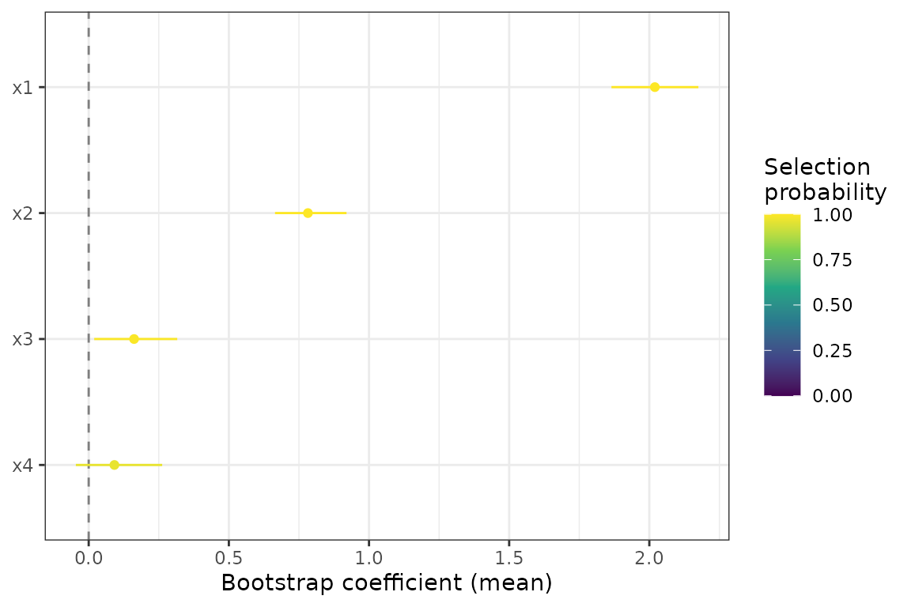
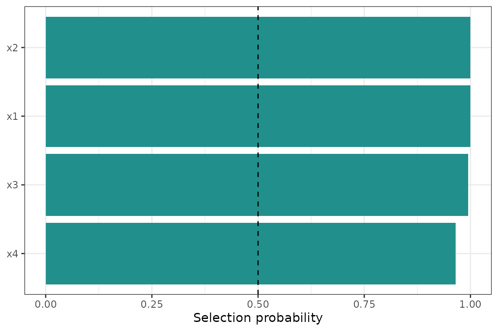

# Getting Started with lassoboot

``` r

library(lassoboot)
```

> **Upgrading from v0.1?** Column names in
> [`tidy()`](https://generics.r-lib.org/reference/tidy.html) output
> changed in v0.2.0: `estimate` → `mean`, `conf.low`/`conf.high` →
> `q025`/`q975`, `std.error` → `sd`. The `conf.level` argument is now
> `probs = c(0.025, 0.975)`. Use
> [`lb_filter_stable()`](https://doctorbear-it.github.io/lassoboot/reference/lb_filter_stable.md)
> instead of
> [`lb_is_significant()`](https://doctorbear-it.github.io/lassoboot/reference/lb_is_significant.md).
> See
> [`vignette("migration-to-v020")`](https://doctorbear-it.github.io/lassoboot/articles/migration-to-v020.md)
> for the full API rename table, and
> [`vignette("methodological-foundations")`](https://doctorbear-it.github.io/lassoboot/articles/methodological-foundations.md)
> for the v0.2.0 conceptual framing.

## What this package does

`lassoboot` answers the question: *which of my predictors actually
matter, given that I measured them with known instrument uncertainty?*

Standard lasso regression assumes predictors are measured exactly. In
practice, every sensor, balance, and test method introduces noise. When
that noise is substantial relative to the predictor range — a 4 %
coefficient of variation on a concrete strength test, a 0.07 wt %
standard deviation on an XRF alumina measurement — it inflates
uncertainty in the coefficient estimates and can cause predictors to be
selected or dropped inconsistently across replicates.

`lassoboot` propagates declared measurement uncertainties through a
parametric bootstrap: in each of *B* iterations the predictors are
perturbed by their declared noise, the response is regenerated from the
fitted model, and lasso is refit. The result is a **selection
probability** (fraction of iterations a predictor is retained) and a
**stability score** (max selection probability across the regularization
path), both of which are more informative than a single regularized
point estimate.

## A four-predictor example

We will use a small synthetic dataset to illustrate the workflow before
introducing the bundled `concrete` data.

``` r

set.seed(101)
n  <- 80
df <- data.frame(
  x1 = rnorm(n),        # strong signal
  x2 = rnorm(n),        # moderate signal
  x3 = rnorm(n),        # noise
  x4 = rnorm(n)         # noise
)
df$y <- 2 * df$x1 + 0.8 * df$x2 + rnorm(n, sd = 0.6)
```

### Step 1: `lb_spec()` — declare the model

``` r

spec <- suppressMessages(
  lb_spec(
    y ~ x1 + x2 + x3 + x4,
    data        = df,
    uncertainty = lb_uncertainty(
      x1 = std(0.10),    # absolute SD of 0.10 units
      x2 = cov(5.0)      # 5 % coefficient of variation
    )
  )
)
spec
#> <lb_spec>
#>   formula:     y ~ x1 + x2 + x3 + x4
#>   data:        80 rows x 5 columns
#>   uncertainty: 2 column(s): x1, x2
#>   derive:      none
#>   constraints: 4 column(s)
#>   engine:      lb_engine_glmnet
#>   control:     <lb_control: all defaults>
```

[`lb_spec()`](https://doctorbear-it.github.io/lassoboot/reference/lb_spec.md)
validates the formula, checks that every uncertainty term exists as a
numeric column, infers non-negativity constraints where appropriate, and
stores everything needed for the bootstrap. No fitting happens yet.

### Step 2: `lb_bootstrap()` — run the parametric bootstrap

``` r

boot <- withr::with_seed(42, lb_bootstrap(spec, B = 200))
boot
#> <lb_spec>
#>   formula:     y ~ x1 + x2 + x3 + x4
#>   data:        80 rows x 5 columns
#>   uncertainty: 2 column(s): x1, x2
#>   derive:      none
#>   constraints: 4 column(s)
#>   engine:      lb_engine_glmnet
#>   control:     <lb_control: all defaults>
#> <lb_fit>
#>   lambda:      0.004985
#>   sigma_hat:   0.6104  (method: refit)
#> <lb_boot>
#>   B:           200 iterations
#>   elapsed:     1.8s
#>   path stored: TRUE
#>   models kept: FALSE
```

With `B = 200` this takes a few seconds. Production analyses typically
use `B = 1000` or more. The seed is set via
[`withr::with_seed()`](https://withr.r-lib.org/reference/with_seed.html)
so the global RNG state is not modified.

### Step 3: `tidy()` — read the results

``` r

library(dplyr)
#> 
#> Attaching package: 'dplyr'
#> The following objects are masked from 'package:stats':
#> 
#>     filter, lag
#> The following objects are masked from 'package:base':
#> 
#>     intersect, setdiff, setequal, union

td <- tidy(boot)
td
#> # A tibble: 4 × 9
#>   term    mean median     sd    q025  q975 selection_prob n_selected
#>   <chr>  <dbl>  <dbl>  <dbl>   <dbl> <dbl>          <dbl>      <int>
#> 1 x1    2.02   2.02   0.0794  1.86   2.18           1            200
#> 2 x2    0.782  0.775  0.0709  0.665  0.920          1            200
#> 3 x3    0.162  0.164  0.0832  0.0197 0.316          0.995        199
#> 4 x4    0.0917 0.0884 0.0833 -0.0458 0.262          0.965        193
#> # ℹ 1 more variable: stability_score <dbl>
```

Each row is one predictor. The key columns:

| Column | Meaning |
|----|----|
| `mean` | Bootstrap mean coefficient (zeros included for unselected iterations) |
| `q025` / `q975` | Bootstrap quantile interval (default 2.5 % and 97.5 % quantiles) |
| `selection_prob` | Fraction of *B* iterations in which this term was selected |
| `stability_score` | Max selection probability across the lambda path |

`x1` and `x2` should have high selection probabilities; `x3` and `x4`
should be near zero.

### Step 4: `autoplot()` — visualize

``` r

autoplot(boot)
```



The color encodes selection probability. Terms towards the right with
dark color are robustly selected with positive effects.

``` r

autoplot(boot, type = "selection")
```



The dashed line at 0.5 is the conventional “majority selection”
threshold. Terms above it are selected in more than half of bootstrap
iterations.

### Filtering stable terms

``` r

lb_filter_stable(tidy(boot), min_selection_prob = 0.5)
#> [1] TRUE TRUE TRUE TRUE
```

[`lb_filter_stable()`](https://doctorbear-it.github.io/lassoboot/reference/lb_filter_stable.md)
filters a [`tidy()`](https://generics.r-lib.org/reference/tidy.html)
data frame to rows meeting one or more stability criteria. Pass
`min_selection_prob`, `min_stability_score`, or
`quantiles_exclude_zero = TRUE` in any combination. The full set of
criteria is discussed in
[`vignette("interpreting-results")`](https://doctorbear-it.github.io/lassoboot/articles/interpreting-results.md).

## The `concrete` dataset

The package ships a 75-row dataset of limestone calcined clay cement
(LC3) mortar cube strength measurements:

``` r

dplyr::glimpse(concrete)
#> Rows: 75
#> Columns: 10
#> $ mixture      <int> 1, 1, 1, 2, 2, 2, 3, 3, 3, 4, 4, 4, 5, 5, 5, 6, 6, 6, 7, …
#> $ clay         <fct> CC0, CC0, CC0, CC0, CC0, CC0, CC0, CC0, CC0, CC0, CC0, CC…
#> $ replacement  <dbl> 10, 10, 10, 25, 25, 25, 15, 15, 15, 30, 30, 30, 20, 20, 2…
#> $ clayHOH      <dbl> 669.1, 669.9, 670.5, 670.3, 669.5, 669.3, 668.4, 669.4, 6…
#> $ alumina      <dbl> 39.47, 39.57, 39.50, 39.55, 39.51, 39.50, 39.41, 39.48, 3…
#> $ SSA          <dbl> 22.14, 22.17, 22.09, 22.11, 22.10, 22.09, 22.30, 22.19, 2…
#> $ D50          <dbl> 2.83, 2.79, 2.77, 2.82, 2.85, 2.75, 2.82, 2.86, 2.84, 2.9…
#> $ strength_MPa <dbl> 42.2, 49.1, 53.9, 40.2, 50.7, 57.6, 43.7, 52.5, 53.9, 38.…
#> $ age          <fct> 7d, 28d, 56d, 7d, 28d, 56d, 7d, 28d, 56d, 7d, 28d, 56d, 7…
#> $ wcm          <dbl> 0.485, 0.485, 0.485, 0.485, 0.485, 0.485, 0.485, 0.485, 0…
```

``` r

uncertainty_concrete
#> # A tibble: 5 × 4
#>   term         type  value source                                         
#>   <chr>        <chr> <dbl> <chr>                                          
#> 1 clayHOH      std    3.2  ASTM C1897 §X3, single-operator reproducibility
#> 2 alumina      std    0.07 ASTM C114 §7.3, method precision               
#> 3 SSA          cov    5.5  Manufacturer certificate of analysis           
#> 4 D50          cov    4    Laser diffraction, repeat measurement CV       
#> 5 strength_MPa cov    3    ASTM C109 §10.3, single-operator precision
```

The companion `uncertainty_concrete` tibble declares ASTM-sourced
measurement uncertainties for each continuous predictor. Passing it to
[`lb_spec()`](https://doctorbear-it.github.io/lassoboot/reference/lb_spec.md)
is all that is needed to activate uncertainty propagation for those
columns.

A full worked example on the `concrete` data appears in
[`vignette("interpreting-results")`](https://doctorbear-it.github.io/lassoboot/articles/interpreting-results.md).
The methodology behind measurement uncertainty propagation and the
choice of sigma method is covered in
[`vignette("measurement-uncertainty")`](https://doctorbear-it.github.io/lassoboot/articles/measurement-uncertainty.md).

## Next steps

- [`vignette("measurement-uncertainty")`](https://doctorbear-it.github.io/lassoboot/articles/measurement-uncertainty.md)
  — the three uncertainty types, derived quantities, normalization, and
  how `sigma_method` affects prediction-band width.
- [`vignette("interpreting-results")`](https://doctorbear-it.github.io/lassoboot/articles/interpreting-results.md)
  — selection probability vs. CI vs. stability score, correlated
  predictors, prediction grids, and nested cross-validation.
- [`?lb_control`](https://doctorbear-it.github.io/lassoboot/reference/lb_control.md)
  — all tuning parameters with defaults and rationale.
- [`?lb_folds_grouped`](https://doctorbear-it.github.io/lassoboot/reference/lb_folds_grouped.md)
  — group-aware cross-validation to prevent mixture leakage across
  folds.
