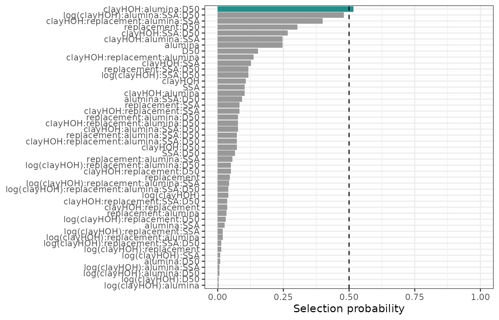
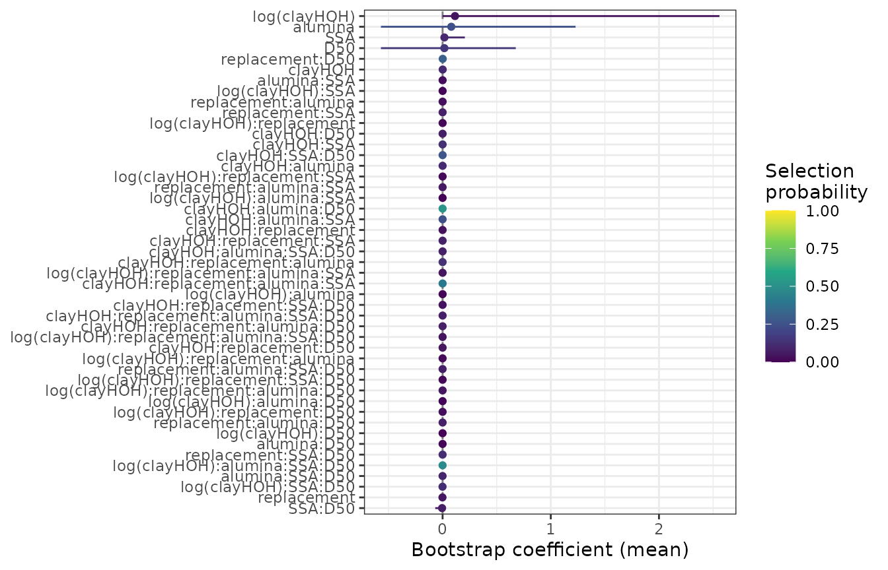
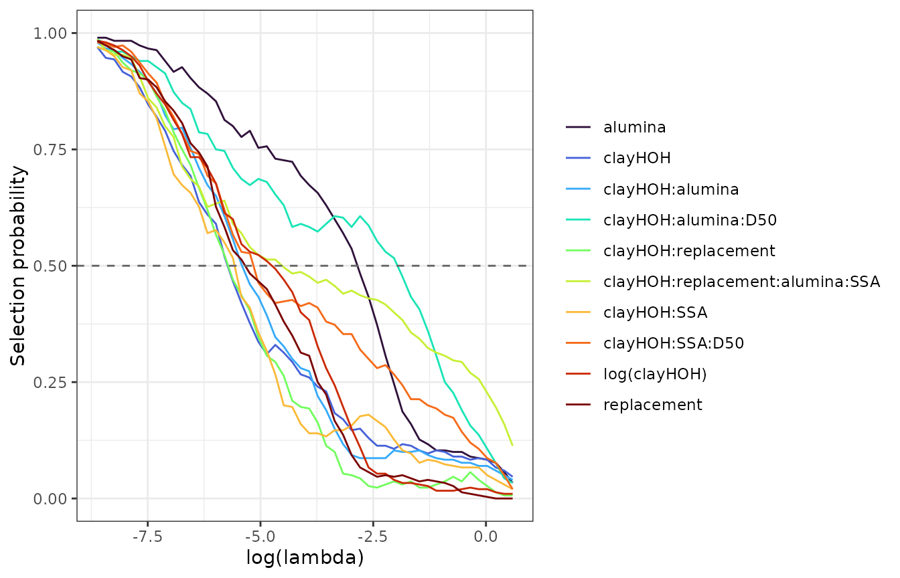
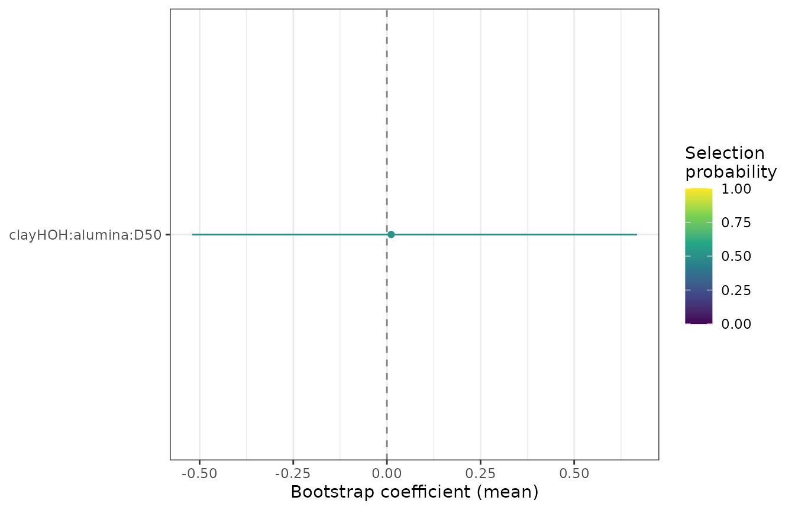
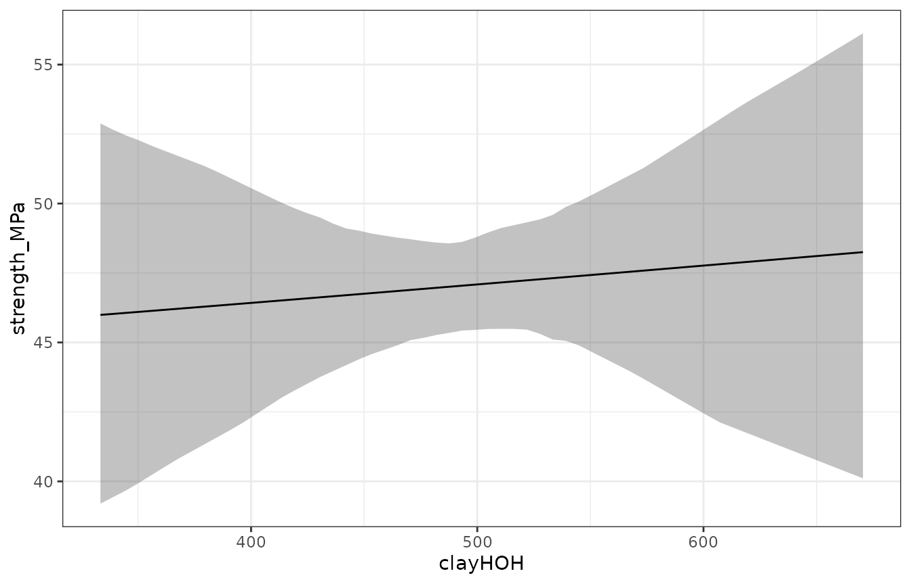
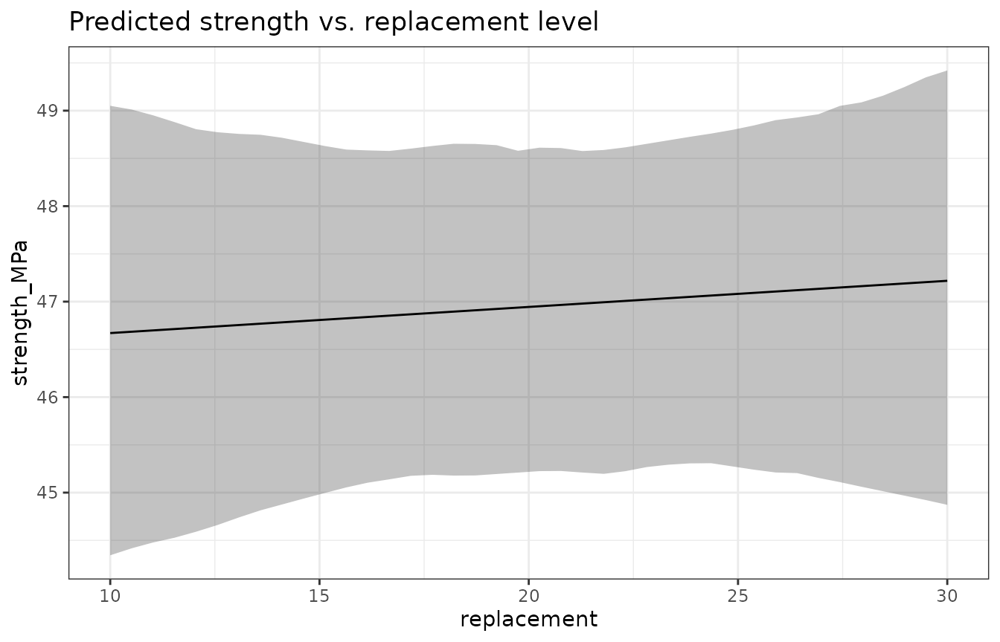
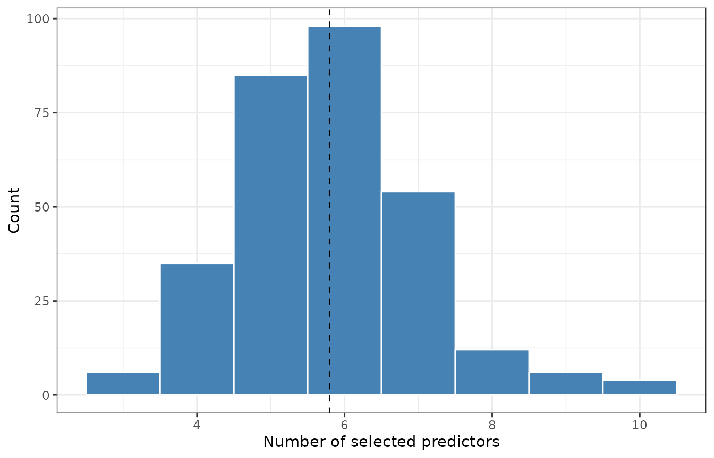

# Interpreting Bootstrap Lasso Results

``` r

library(lassoboot)
library(dplyr)
#> 
#> Attaching package: 'dplyr'
#> The following objects are masked from 'package:stats':
#> 
#>     filter, lag
#> The following objects are masked from 'package:base':
#> 
#>     intersect, setdiff, setequal, union
```

> **Upgrading from v0.1?** Column names in
> [`tidy()`](https://generics.r-lib.org/reference/tidy.html) output
> changed in v0.2.0: `estimate` → `mean`, `conf.low`/`conf.high` →
> `q025`/`q975`, `std.error` → `sd`. The `conf.level` argument is now
> `probs = c(0.025, 0.975)`. Use
> [`lb_filter_stable()`](https://doctorbear-it.github.io/lassoboot/reference/lb_filter_stable.md)
> instead of
> [`lb_is_significant()`](https://doctorbear-it.github.io/lassoboot/reference/lb_is_significant.md).
> See
> [`vignette("migration-to-v020")`](https://doctorbear-it.github.io/lassoboot/articles/migration-to-v020.md)
> for the full API rename table, and
> [`vignette("methodological-foundations")`](https://doctorbear-it.github.io/lassoboot/articles/methodological-foundations.md)
> for the v0.2.0 conceptual framing.

## Building the concrete dataset model

We will work through a complete example using the bundled `concrete`
dataset — 75 mortar cube strength measurements from five calcined clay
cement (LC3) blends at three ages.

``` r

spec <- suppressMessages(
  lb_spec(
    strength_MPa ~ (clayHOH + log(clayHOH)) * replacement * alumina * SSA * D50,
    data        = concrete,
    uncertainty = uncertainty_concrete,
    folds       = lb_folds_grouped("mixture")
  )
)
```

The `folds = lb_folds_grouped("mixture")` argument ensures that all age
measurements for a given mixture are assigned to the same
cross-validation fold — preventing mixture identity from leaking across
train/test splits.

``` r

boot <- withr::with_seed(2025, lb_bootstrap(spec, B = 300))
#> Warning: from glmnet C++ code (error code -49); Convergence for 49th lambda
#> value not reached after maxit=100000 iterations; solutions for larger lambdas
#> returned
#> Warning: from glmnet C++ code (error code -47); Convergence for 47th lambda
#> value not reached after maxit=100000 iterations; solutions for larger lambdas
#> returned
#> Warning: from glmnet C++ code (error code -49); Convergence for 49th lambda
#> value not reached after maxit=100000 iterations; solutions for larger lambdas
#> returned
#> Warning: from glmnet C++ code (error code -49); Convergence for 49th lambda
#> value not reached after maxit=100000 iterations; solutions for larger lambdas
#> returned
#> Warning: from glmnet C++ code (error code -47); Convergence for 47th lambda
#> value not reached after maxit=100000 iterations; solutions for larger lambdas
#> returned
#> Warning: from glmnet C++ code (error code -45); Convergence for 45th lambda
#> value not reached after maxit=100000 iterations; solutions for larger lambdas
#> returned
#> Warning: from glmnet C++ code (error code -49); Convergence for 49th lambda
#> value not reached after maxit=100000 iterations; solutions for larger lambdas
#> returned
#> Warning: from glmnet C++ code (error code -47); Convergence for 47th lambda
#> value not reached after maxit=100000 iterations; solutions for larger lambdas
#> returned
#> Warning: from glmnet C++ code (error code -49); Convergence for 49th lambda
#> value not reached after maxit=100000 iterations; solutions for larger lambdas
#> returned
#> Warning: from glmnet C++ code (error code -49); Convergence for 49th lambda
#> value not reached after maxit=100000 iterations; solutions for larger lambdas
#> returned
#> Warning: from glmnet C++ code (error code -48); Convergence for 48th lambda
#> value not reached after maxit=100000 iterations; solutions for larger lambdas
#> returned
#> Warning: from glmnet C++ code (error code -47); Convergence for 47th lambda
#> value not reached after maxit=100000 iterations; solutions for larger lambdas
#> returned
#> Warning: from glmnet C++ code (error code -50); Convergence for 50th lambda
#> value not reached after maxit=100000 iterations; solutions for larger lambdas
#> returned
#> Warning: from glmnet C++ code (error code -44); Convergence for 44th lambda
#> value not reached after maxit=100000 iterations; solutions for larger lambdas
#> returned
#> Warning: from glmnet C++ code (error code -45); Convergence for 45th lambda
#> value not reached after maxit=100000 iterations; solutions for larger lambdas
#> returned
#> Warning: from glmnet C++ code (error code -43); Convergence for 43th lambda
#> value not reached after maxit=100000 iterations; solutions for larger lambdas
#> returned
#> Warning: from glmnet C++ code (error code -47); Convergence for 47th lambda
#> value not reached after maxit=100000 iterations; solutions for larger lambdas
#> returned
#> Warning: from glmnet C++ code (error code -46); Convergence for 46th lambda
#> value not reached after maxit=100000 iterations; solutions for larger lambdas
#> returned
#> Warning: from glmnet C++ code (error code -44); Convergence for 44th lambda
#> value not reached after maxit=100000 iterations; solutions for larger lambdas
#> returned
#> Warning: from glmnet C++ code (error code -48); Convergence for 48th lambda
#> value not reached after maxit=100000 iterations; solutions for larger lambdas
#> returned
#> Warning: from glmnet C++ code (error code -50); Convergence for 50th lambda
#> value not reached after maxit=100000 iterations; solutions for larger lambdas
#> returned
```

## Three complementary significance criteria

[`tidy()`](https://generics.r-lib.org/reference/tidy.html) returns one
row per predictor with estimates, confidence intervals, and three
complementary diagnostics:

``` r

td <- tidy(boot)
select(td, term, mean, q025, q975, selection_prob, stability_score) |>
  arrange(desc(selection_prob))
#> # A tibble: 47 × 6
#>    term                     mean     q025    q975 selection_prob stability_score
#>    <chr>                   <dbl>    <dbl>   <dbl>          <dbl>           <dbl>
#>  1 clayHOH:alumina:D50   3.85e-6 -1.75e-4 2.25e-4          0.517           0.987
#>  2 log(clayHOH):alumin… -1.38e-4 -1.13e-3 4.43e-4          0.48            0.967
#>  3 clayHOH:replacement…  8.71e-8 -5.45e-8 6.18e-7          0.4             0.987
#>  4 replacement:D50       1.14e-3 -2.33e-2 3.15e-2          0.303           0.957
#>  5 clayHOH:SSA:D50       1.74e-5 -1.16e-4 2.42e-4          0.267           0.98 
#>  6 alumina               8.02e-2 -5.70e-1 1.23e+0          0.247           0.99 
#>  7 clayHOH:alumina:SSA   2.14e-6  0       1.73e-5          0.247           0.967
#>  8 D50                   1.63e-2 -5.70e-1 6.76e-1          0.153           0.95 
#>  9 clayHOH:replacement…  1.84e-7 -1.80e-6 6.42e-6          0.137           0.97 
#> 10 clayHOH:SSA           2.45e-5  0       2.96e-4          0.127           0.97 
#> # ℹ 37 more rows
```

### 1. Selection probability

``` r

autoplot(boot, type = "selection", threshold = 0.5)
```



**Selection probability** is the fraction of bootstrap iterations in
which a predictor had a nonzero coefficient at `lambda.min`. It answers:
*over repeated perturbations of the data, how often does lasso choose
this predictor?*

A threshold of 0.5 (“majority selection”) is a reasonable starting point
for exploratory analysis. Use
[`lb_is_significant()`](https://doctorbear-it.github.io/lassoboot/reference/lb_is_significant.md)
to filter:

``` r

td |> filter(lb_is_significant(pick(everything()), method = "selection", threshold = 0.5))
#> Warning: There was 1 warning in `filter()`.
#> ℹ In argument: `lb_is_significant(pick(everything()), method = "selection",
#>   threshold = 0.5)`.
#> Caused by warning:
#> ! `lb_is_significant()` is deprecated.
#> ℹ Use `lb_filter_stable()` with named arguments instead:
#> ℹ `lb_filter_stable(td, min_selection_prob = 0.5)`
#> ℹ `lb_filter_stable(td, min_stability_score = 0.8)`
#> ℹ `lb_filter_stable(td, quantiles_exclude_zero = TRUE)`
#> # A tibble: 1 × 9
#>   term            mean median      sd     q025    q975 selection_prob n_selected
#>   <chr>          <dbl>  <dbl>   <dbl>    <dbl>   <dbl>          <dbl>      <int>
#> 1 clayHOH:alu… 3.85e-6      0 9.57e-5 -1.75e-4 2.25e-4          0.517        155
#> # ℹ 1 more variable: stability_score <dbl>
```

### 2. CI exclusion of zero

``` r

autoplot(boot)
```



Bootstrap CIs that exclude zero are a supplementary indicator — a
predictor can have a CI excluding zero but a low selection probability
if it is selected inconsistently (see the correlated-predictor section
below). CIs should be paired with selection probability, not used alone.

``` r

td |> filter(lb_is_significant(pick(everything()), method = "ci"))
#> # A tibble: 0 × 9
#> # ℹ 9 variables: term <chr>, mean <dbl>, median <dbl>, sd <dbl>, q025 <dbl>,
#> #   q975 <dbl>, selection_prob <dbl>, n_selected <int>, stability_score <dbl>
```

### 3. Stability score

``` r

autoplot(boot, type = "stability", top_n = 10)
```



**Stability score** is the maximum selection probability across the full
regularization path. A predictor with a high stability score is selected
consistently regardless of the specific lambda value chosen — it is
robust to the arbitrary choice of regularization strength.

Stability is the most conservative criterion. For confirmatory claims in
a publication, require `stability_score > 0.8`.

``` r

td |> filter(lb_is_significant(pick(everything()), method = "stability", threshold = 0.8))
#> # A tibble: 47 × 9
#>    term           mean median      sd     q025    q975 selection_prob n_selected
#>    <chr>         <dbl>  <dbl>   <dbl>    <dbl>   <dbl>          <dbl>      <int>
#>  1 clayHOH     8.87e-4      0 3.84e-3  0       1.40e-2        0.107           32
#>  2 log(clayH…  1.15e-1      0 8.39e-1  0       2.56e+0        0.04            12
#>  3 replaceme… -1.29e-3      0 2.44e-2 -0.00328 0              0.0467          14
#>  4 alumina     8.02e-2      0 4.24e-1 -0.570   1.23e+0        0.247           74
#>  5 SSA         1.66e-2      0 8.15e-2  0       2.06e-1        0.103           31
#>  6 D50         1.63e-2      0 2.59e-1 -0.570   6.76e-1        0.153           46
#>  7 clayHOH:r…  4.95e-7      0 3.29e-5  0       0              0.0367          11
#>  8 log(clayH…  3.72e-5      0 5.18e-4  0       0              0.0133           4
#>  9 clayHOH:a…  1.70e-5      0 6.80e-5  0       2.32e-4        0.103           31
#> 10 log(clayH…  4.30e-8      0 7.45e-7  0       0              0.00333          1
#> # ℹ 37 more rows
#> # ℹ 1 more variable: stability_score <dbl>
```

### When to use each

| Goal | Recommended criterion |
|----|----|
| Exploratory screening | Selection probability ≥ 0.5 |
| Reducing to a parsimonious model | Stability score ≥ 0.8 |
| Reporting effect sizes | Bootstrap CI, paired with one of the above |
| All three simultaneous | `method = "all"` |

## Gelman 2-SD scaling for comparing effect sizes

Raw lasso coefficients are in the original units of each predictor and
cannot be compared directly when predictors have different scales (SSA
in m²/g vs. replacement in %). The `scale = "gelman"` option in
[`tidy()`](https://generics.r-lib.org/reference/tidy.html) multiplies
each coefficient by `2 * sd(predictor)`, placing all numeric predictors
on a “2-standard-deviation change” scale (Gelman 2008):

``` r

tidy(boot, scale = "gelman") |>
  select(term, mean, q025, q975, selection_prob) |>
  arrange(desc(abs(mean)))
#> # A tibble: 47 × 5
#>    term                   mean   q025  q975 selection_prob
#>    <chr>                 <dbl>  <dbl> <dbl>          <dbl>
#>  1 alumina              0.276  -1.96  4.22          0.247 
#>  2 clayHOH              0.204   0     3.22          0.107 
#>  3 SSA:D50             -0.140  -1.98  0             0.0667
#>  4 SSA                  0.129   0     1.60          0.103 
#>  5 clayHOH:SSA:D50      0.117  -0.776 1.62          0.267 
#>  6 log(clayHOH)         0.115   0     2.56          0.04  
#>  7 D50                  0.0612 -2.14  2.54          0.153 
#>  8 replacement:D50      0.0608 -1.25  1.69          0.303 
#>  9 replacement:SSA:D50 -0.0549 -0.834 0             0.117 
#> 10 clayHOH:SSA          0.0437  0     0.529         0.127 
#> # ℹ 37 more rows
```

A coefficient of 0.15 on this scale means: changing the predictor from
its mean to one SD above its mean changes the predicted response by
about 0.075 units (half of the 2-SD effect). This allows direct
comparison of clayHOH (range ~330–670 J/g) with replacement (range 10–30
%) on the same axis.

``` r

autoplot(boot, scale = "gelman", filter = "selected")
```



## Correlated predictors

Lasso tends to select one variable from a group of correlated predictors
arbitrarily.
[`lb_correlated_pairs()`](https://doctorbear-it.github.io/lassoboot/reference/lb_correlated_pairs.md)
identifies pairs where:

1.  Correlation in the original data exceeds `cor_threshold`.
2.  Neither predictor alone has a high selection probability.
3.  The joint “either is selected” probability is high.

``` r

pairs <- lb_correlated_pairs(boot, cor_threshold = 0.7, prob_threshold = 0.5)
pairs
#> # A tibble: 20 × 6
#>    term_1                          term_2  correlation prob_1 prob_2 prob_either
#>    <chr>                           <chr>         <dbl>  <dbl>  <dbl>       <dbl>
#>  1 clayHOH                         log(cl…      -0.931 0.107    0.48       0.527
#>  2 log(clayHOH)                    log(cl…      -0.922 0.04     0.48       0.513
#>  3 alumina                         clayHO…       0.747 0.247    0.4        0.557
#>  4 alumina                         log(cl…      -0.900 0.247    0.48       0.637
#>  5 SSA                             log(cl…      -0.916 0.103    0.48       0.55 
#>  6 D50                             log(cl…       0.861 0.153    0.48       0.54 
#>  7 clayHOH:alumina                 log(cl…      -0.932 0.103    0.48       0.53 
#>  8 clayHOH:SSA                     log(cl…      -0.935 0.127    0.48       0.547
#>  9 clayHOH:D50                     log(cl…       0.854 0.0733   0.48       0.513
#> 10 SSA:D50                         log(cl…       0.952 0.0667   0.48       0.547
#> 11 clayHOH:replacement:alumina     clayHO…       0.963 0.137    0.4        0.517
#> 12 clayHOH:replacement:SSA         log(cl…      -0.705 0.0833   0.48       0.53 
#> 13 clayHOH:alumina:SSA             clayHO…       0.774 0.247    0.4        0.533
#> 14 clayHOH:alumina:SSA             log(cl…      -0.935 0.247    0.48       0.567
#> 15 clayHOH:SSA:D50                 clayHO…       0.760 0.267    0.4        0.54 
#> 16 clayHOH:SSA:D50                 log(cl…      -0.863 0.267    0.48       0.67 
#> 17 log(clayHOH):SSA:D50            log(cl…       0.968 0.117    0.48       0.58 
#> 18 alumina:SSA:D50                 log(cl…       0.981 0.0933   0.48       0.547
#> 19 clayHOH:replacement:alumina:SSA log(cl…      -0.726 0.4      0.48       0.69 
#> 20 clayHOH:alumina:SSA:D50         log(cl…      -0.884 0.0767   0.48       0.547
```

If any pairs are flagged, the appropriate action depends on domain
knowledge: - If the two predictors measure the same underlying
phenomenon, prefer the one with lower measurement uncertainty. - If they
measure distinct aspects, consider including both and noting the
instability in your write-up. - The stability score is particularly
useful here: if only one of a correlated pair has a high stability
score, that one is the more robust choice.

## Prediction grids: `lb_grid()` and `lb_plot_prediction()`

[`lb_plot_prediction()`](https://doctorbear-it.github.io/lassoboot/reference/lb_plot_prediction.md)
wraps
[`lb_grid()`](https://doctorbear-it.github.io/lassoboot/reference/lb_grid.md)
to produce a ribbon plot of `.fitted ± CI` vs. a focal predictor, with
all other predictors held at their median:

``` r

lb_plot_prediction(boot, focal = "clayHOH", n = 60)
```



``` r

lb_plot_prediction(boot, focal = "replacement", n = 40) +
  ggplot2::labs(title = "Predicted strength vs. replacement level")
```



The `at = "median"` default (holding non-focal predictors at their
observed median) is appropriate for a marginal effect plot. For
per-combination ribbons (showing one ribbon per unique clay × age
combination), call
[`lb_grid()`](https://doctorbear-it.github.io/lassoboot/reference/lb_grid.md)
directly with `at = "observed"` and build the ggplot manually:

``` r

grid <- lb_grid(boot, focal = "clayHOH", n = 60, at = "observed")
# grid has one predicted row per (clayHOH value × observed combination)
```

**Extrapolation warning.**
[`lb_grid()`](https://doctorbear-it.github.io/lassoboot/reference/lb_grid.md)
clips grid values to the observed range by default. Pass
`extrapolate = TRUE` to extend beyond the data; mark any extrapolated
region clearly in the final plot.

## Confidence bands vs. prediction bands

[`lb_grid()`](https://doctorbear-it.github.io/lassoboot/reference/lb_grid.md)
and
[`lb_plot_prediction()`](https://doctorbear-it.github.io/lassoboot/reference/lb_plot_prediction.md)
support two types of uncertainty interval for the fitted response,
selected with the `interval` argument.

**Confidence band** (`interval = "confidence"`, the default): captures
uncertainty in the *mean response* — how precisely the regression
surface is estimated from the data. It reflects only variability in the
bootstrap coefficient estimates. Confidence bands narrow as *n* grows
and the model becomes better determined, but they do **not** account for
the scatter of individual observations around the trend.

**Prediction band** (`interval = "prediction"`): answers the question
*where will a new individual measurement fall?* It adds the residual
scatter *σ̂* (estimated inside
[`lb_bootstrap()`](https://doctorbear-it.github.io/lassoboot/reference/lb_bootstrap.md))
on top of the confidence envelope. A new observation drawn from the same
process will fall outside the prediction band only with probability
equal to the nominal level — regardless of sample size.

``` r

# Confidence band: uncertainty in the mean trend
lb_plot_prediction(boot, focal = "clayHOH", n = 60, interval = "confidence")

# Prediction band: where a new data point will fall
lb_plot_prediction(boot, focal = "clayHOH", n = 60, interval = "prediction")
```

The additional width of the prediction band over the confidence band is
approximately `σ̂ × √(1 + 1/n)` at the median predictor values. When the
model is well-determined (large *n*, high selection probability) but has
genuine residual scatter (e.g. between-batch variation in cement
production), prediction bands can be substantially wider than confidence
bands. That difference is the honest answer to “how repeatable is a new
test?”

[`lb_plot_envelopes()`](https://doctorbear-it.github.io/lassoboot/reference/lb_plot_envelopes.md)
(new in v0.2.0) plots both simultaneously: a wider, lower-opacity
prediction ribbon behind a narrower confidence ribbon. Use
`interval = "both"` to activate this overlay:

``` r

lb_plot_envelopes(boot, focal = "clayHOH", interval = "both", n = 60)
```

**Practical guidance:**

| Plotting goal | Recommended interval |
|----|----|
| “How well do we know the mean trend?” | `"confidence"` |
| “Where will a new measurement fall?” | `"prediction"` |
| Communicate both to a broad audience | `"both"` in [`lb_plot_envelopes()`](https://doctorbear-it.github.io/lassoboot/reference/lb_plot_envelopes.md) |

## Nested cross-validation: `lb_folds_nested()`

When the data has a nested structure — multiple replicates per mixture,
each mixture at multiple ages — a plain k-fold CV can leak mixture
identity into the test fold. Use
[`lb_folds_nested()`](https://doctorbear-it.github.io/lassoboot/reference/lb_folds_nested.md)
to prevent this:

``` r

spec_nested <- suppressMessages(
  lb_spec(
    strength_MPa ~ (clayHOH + log(clayHOH)) * replacement * alumina,
    data  = concrete,
    uncertainty = uncertainty_concrete,
    folds = lb_folds_nested(
      outer = "mixture",   # whole mixtures in same fold
      inner = "age",       # balance age distribution within each fold
      k_outer = 5
    )
  )
)
```

`lb_folds_grouped("mixture")` (used above) is the simple version: all
rows for a given mixture are assigned to the same fold.
[`lb_folds_nested()`](https://doctorbear-it.github.io/lassoboot/reference/lb_folds_nested.md)
additionally stratifies *within* each fold by the `inner` variable so
that each fold sees a balanced age distribution.

For the `concrete` dataset with only 25 unique mixtures and 5-fold CV,
the difference between grouped and nested is small. The effect is
largest in datasets where some combinations are rarer (e.g. missing ages
for certain mixtures).

## Model complexity

``` r

autoplot(boot, type = "complexity")
```



The complexity histogram shows the distribution of how many predictors
were selected across bootstrap iterations. A wide distribution
(spanning, say, 2–12 predictors) suggests the model is on the border of
the bias-variance trade-off and the lambda selection is sensitive to the
data. A tight distribution centered on a small number is reassuring.

## References

Gelman, A. (2008). Scaling regression inputs by dividing by two standard
deviations. *Statistics in Medicine*, **27**(15), 2865–2873.

Meinshausen, N. and Bühlmann, P. (2010). Stability selection. *Journal
of the Royal Statistical Society: Series B*, **72**(4), 417–473.
